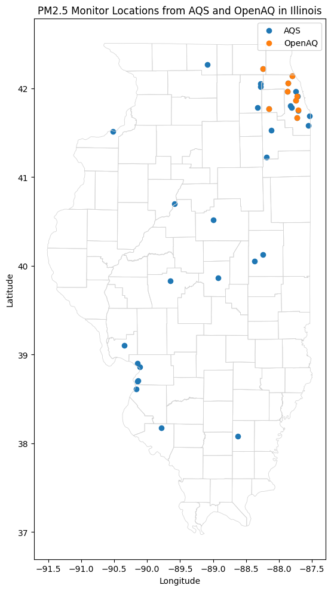
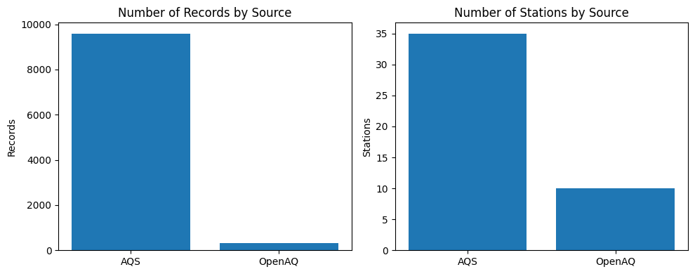
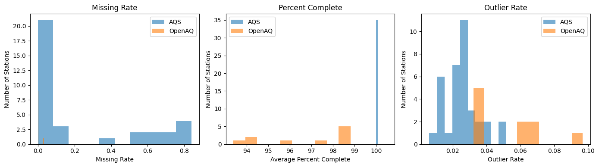

# Environmental Monitoring Coverage and Bias Auditor for PM2.5 in Illinois

Allen Wang and Daniel Duan

## Abstract

This project develops a reproducible environmental monitoring auditor for fine particulate matter (PM2.5) in Illinois. The workflow combines U.S. Environmental Protection Agency Air Quality System (AQS) observations with OpenAQ observations, standardizes both sources into a shared schema, and produces station-level coverage and data-quality diagnostics. The current implementation emphasizes a realistic undergraduate machine learning workflow rather than a fully operational air-quality calibration system. AQS provides the broader Illinois monitoring backbone, while OpenAQ serves as a supplementary source for paired comparison and exploratory modeling. For paired PM2.5 observations, a random forest regressor and a linear regression baseline are used to estimate AQS-like PM2.5 values from OpenAQ and station-pair features. The random forest model performed slightly better than linear regression, with an R2 of 0.8784, RMSE of 1.378 ug/m3, and MAE of 0.7239 ug/m3. These results suggest that OpenAQ data can support exploratory comparison with AQS, but the limited OpenAQ station count, uneven spatial coverage, and temporal coverage differences mean that AQS remains the more reliable reference source for statewide interpretation.

## Significance Statement

PM2.5 monitoring networks are not evenly distributed, so a reproducible audit of monitor coverage and data quality is important before using observations for environmental interpretation or machine learning. This project shows how regulatory AQS data and OpenAQ data can be collected, harmonized, evaluated, and compared with simple supervised learning models. The workflow helps identify where the data are strong, where they are incomplete, and why supplementary sources should be screened carefully before being used as substitutes for regulatory monitoring.

## 1. Introduction

This project examines PM2.5 monitoring coverage and data quality in Illinois, with particular attention to the Chicago-DeKalb corridor and the broader statewide monitoring network. PM2.5 is an appropriate focus for a geoscience data project because concentrations can vary substantially across short distances, while monitor coverage is spatially uneven. That combination makes PM2.5 useful for studying how different monitoring systems represent environmental conditions and where important gaps may remain.

The original project proposal attempted to cover monitor coverage, data-quality checks, and more advanced calibration or bias-correction ideas at the same time. The final workflow narrows that scope into a more realistic course project centered on three questions: how to collect PM2.5 data from multiple sources, how to standardize those records into one shared structure, and how to generate basic coverage, data-quality, and machine learning diagnostics in a reproducible way.

## 2. Data and Methods

### 2a. Data Sources

The project uses two main PM2.5 data sources:

1. EPA AQS daily PM2.5 observations.
2. OpenAQ PM2.5 observations and metadata.

AQS is treated as the primary regulatory reference source. OpenAQ is treated as a supplementary open-data source that can add comparison value but must be screened for spatial, temporal, and quality limitations.

### 2b. Study Area and Time Period

The study area is Illinois, with emphasis on the Chicago-DeKalb corridor in northeastern Illinois. The current workflow is configured for 2024. AQS is queried at the Illinois state level. OpenAQ is queried by a bounding box and location limit, so OpenAQ results should be interpreted as a supplementary sample rather than a complete census of all possible OpenAQ PM2.5 locations in Illinois.

### 2c. Preprocessing

The workflow standardizes records into a shared schema with source provider, station ID, timestamps, coordinates, units, PM2.5 value, quality flag, expected count, observed count, and percent complete. The processing steps include timestamp normalization, numeric type conversion, duplicate removal, station-level completeness metrics, outlier-rate calculations, and AQS-OpenAQ paired observations for machine learning.

### 2d. Machine Learning Methods

The machine learning task is supervised regression. The target variable is AQS PM2.5 concentration, and the predictors include OpenAQ PM2.5 concentration, percent completeness, day of year, and the spatial difference between paired AQS and OpenAQ stations. The workflow compares a linear regression baseline with a random forest regressor. Linear regression is included because it is simple and interpretable. Random forest regression is included because it can capture nonlinear relationships while remaining appropriate for a course-level model comparison.

Training and validation are organized with grouped cross-validation by station pair. This avoids placing observations from the same AQS-OpenAQ pair into both training and validation folds in a way that would make the model evaluation look too optimistic. Model selection is based on standard regression metrics: RMSE, MAE, and R2.

## 3. Results

### 3a. Coverage and Data Quality

The 2024 workflow returned 35 AQS stations and 10 OpenAQ stations. AQS contributed 9591 records, while OpenAQ contributed 308 records. This difference shows that AQS provides the broader and more stable Illinois monitoring backbone, while OpenAQ is useful mainly as a supplementary source.

| Provider | Stations | Records | Average PM2.5 | Average missing rate | Average percent complete |
| --- | ---: | ---: | ---: | ---: | ---: |
| AQS | 35 | 9591 | 7.459 | 0.2260 | 100.0 |
| OpenAQ | 10 | 308 | 8.657 | 0.0032 | 96.9 |

Table 1. Summary of station count, record count, average PM2.5, and coverage metrics by provider.

AQS has many more records and stations, but some AQS stations have substantial missingness. OpenAQ has a low missing rate within the downloaded period, but its station count and record count are much smaller. Therefore, OpenAQ completeness should not be interpreted as stronger statewide coverage.

### 3b. Machine Learning Performance

The random forest regressor performed slightly better than the linear regression baseline. However, the small performance gap means that a simple linear relationship already explains much of the paired AQS-OpenAQ variation.

| Model | Folds | RMSE | MAE | R2 |
| --- | ---: | ---: | ---: | ---: |
| RandomForestRegressor | 3 | 1.3780 | 0.7239 | 0.8784 |
| LinearRegression | 3 | 1.4024 | 0.7904 | 0.8722 |

Table 2. Grouped cross-validation model metrics for predicting AQS PM2.5 from OpenAQ and station-pair features.

RMSE and MAE are in ug/m3. The random forest MAE of 0.7239 means that the model's average absolute prediction error is less than 1 ug/m3. The RMSE of 1.3780 is larger than the MAE, which indicates that some paired observations have larger errors. The R2 of 0.8784 means that the model explains about 87.8% of the variation in paired AQS PM2.5 values.

### 3c. Initial Figures

Using the current 12-month PM2.5 workflow, the auditor produces figures that summarize the statewide monitor network, the relative size of each data source, and the quality characteristics of station-level records.



Figure 1. PM2.5 monitor locations from EPA AQS and OpenAQ in Illinois. County boundaries are shown for geographic reference. API-returned points outside the Illinois land boundary should be excluded from Illinois coverage interpretation.

Figure 1 shows that monitor coverage is spatially uneven. AQS provides a broader statewide backbone, while OpenAQ contributes a smaller supplementary network. Because OpenAQ uses a rectangular query region, some returned locations can fall outside the Illinois state boundary unless a state-boundary spatial filter is applied.



Figure 2. Number of PM2.5 records and number of unique monitoring stations by source.

Figure 2 shows that AQS contributes most of the total PM2.5 records and most of the unique station locations. OpenAQ adds useful observations, but it does not replace AQS for statewide analysis.



Figure 3. Station-level quality metrics by source. The histograms show the distributions of missing rate, average percent complete, and outlier rate across AQS and OpenAQ stations.

Figure 3 indicates that station-level quality is not uniform. Some AQS stations have nearly complete records, while other stations have much larger missing fractions. OpenAQ records are relatively complete within the downloaded period, but the smaller number of stations and records limits broader interpretation.

## 4. Discussion and Conclusions

The project demonstrates that a reproducible PM2.5 auditor can identify important differences between regulatory and open monitoring sources. AQS has broader Illinois coverage and should remain the primary reference source. OpenAQ can support exploratory comparison and paired modeling, but its limited station count, rectangular bounding-box query, and smaller record count require careful caveats.

The machine learning results support the idea that OpenAQ observations contain useful information for estimating nearby AQS PM2.5 values. However, the model should be interpreted as exploratory calibration rather than a final scientific correction model. The strongest project conclusion is not that OpenAQ can replace AQS, but that a transparent audit can show when supplementary data are useful and when their limitations matter.

## 5. Reproducibility and Repository Use

### 5a. Repository Structure

The most important files in the repository are:

- [notebooks/PM25_Auditor_Workflow.ipynb](notebooks/PM25_Auditor_Workflow.ipynb): main reproducible notebook.
- [src/pm25_auditor/pipeline.py](src/pm25_auditor/pipeline.py): shared processing utilities used by the workflow.
- [config.yaml](config.yaml): study settings and output paths.
- [docs/data_dictionary.md](docs/data_dictionary.md): internal schema documentation.
- [data/sample/](data/sample): included sample datasets for reproducible runs without API access.

### 5b. How to Run the Project

Install the required packages:

```bash
pip install -r requirements.txt
```

To run in default reproducible mode:

1. Open [PM25_Auditor_Workflow.ipynb](notebooks/PM25_Auditor_Workflow.ipynb).
2. Leave `USE_SAMPLE_DATA = True`.
3. Run the notebook from top to bottom.

To run with live AQS and OpenAQ data:

1. Create a `.env` file in the repository root based on `.env.example`.
2. Add credentials in this format:

```env
AQS_EMAIL=your_email_here
AQS_KEY=your_aqs_key_here
OPENAQ_KEY=your_openaq_key_here
```

3. Set `USE_SAMPLE_DATA = False` in the notebook.
4. Run the notebook from the beginning.

### 5c. Expected Outputs

After a successful run, the project writes these outputs:

- `data/processed/aqs_clean.csv`
- `data/processed/openaq_clean.csv`
- `data/processed/audit_table.csv`
- `reports/station_quality_metrics.csv`
- `reports/coverage_summary.csv`
- `reports/data_quality_summary.csv`
- `reports/model_metrics.csv`
- `figures/monthly_mean_by_provider.png`
- `figures/station_map.png`

## 6. Availability Statement

The project code, notebook, sample data, configuration file, and documentation are available in this GitHub repository: [https://github.com/wweijia0107/EAE-483-Group-Project](https://github.com/wweijia0107/EAE-483-Group-Project). Live API runs require separate AQS and OpenAQ credentials, which are not stored in the repository. Generated raw, processed, report, and figure outputs are reproducible from the notebook but are not all committed because some output directories are intentionally ignored.

## APPENDIX A. Requirements Document Crosswalk

This appendix summarizes how the repository maps to the course project requirements document, `Environmental_Monitoring_Requirements_Document.docx`. Items marked complete in the planning document are fully represented in the repository. Items originally marked planned or in progress were narrowed to fit the final reproducible PM2.5 auditor scope.

| Requirement | Original intent | Current repository status |
| --- | --- | --- |
| PR-01: Finalize scope, schema, and API access | Define study region, PM2.5 focus, APIs, and data dictionary. | Complete. The project uses PM2.5, AQS, OpenAQ, `config.yaml`, and `docs/data_dictionary.md`. |
| PR-02: Build data ingestion and caching pipeline | Retrieve AQS and OpenAQ data and preserve source provenance. | Partially complete. The notebook retrieves live data in API mode and supports sample-data mode for reproducibility. |
| PR-03: Harmonize timestamps, units, and variables | Standardize timestamps, units, pollutant fields, and source fields. | Complete for the final workflow. The notebook and pipeline harmonize timestamps, units, PM2.5 values, provider labels, and station IDs. |
| PR-04: Engineer data-quality features | Compute sensor-level quality features. | Partially complete. The workflow computes missing rate, percent complete, outlier rate, mean PM2.5, and standard deviation. |
| PR-05: Spatial joins and demographic context | Link monitors to census geography and environmental justice covariates. | Deferred. The final project focuses on monitoring coverage and data quality rather than demographic integration. |
| PR-06: Coverage diagnostics and equity metrics | Produce coverage summaries, maps, and tabular diagnostics. | Partially complete. The workflow generates monitor maps, station counts, coverage summaries, and quality diagnostics; demographic grouping was deferred. |
| PR-07: Sensor reliability scoring model | Use unsupervised methods to score sensor reliability. | Deferred. The final machine learning scope uses supervised regression for paired AQS-OpenAQ comparison. |
| PR-08: Bias correction or calibration model | Pair supplementary sensors with AQS and evaluate regression models. | Complete at baseline level. The workflow pairs AQS and OpenAQ records and compares linear regression with random forest regression using grouped cross-validation. |
| PR-09: Package reproducible auditor workflow and documentation | Provide runnable notebook, README, outputs, and logging/error handling. | Complete at course-project level. The repository includes a notebook, configuration, sample data, documentation, expected outputs, and reproducibility instructions. |

The main scope revision was intentional: instead of attempting every planned extension, the final repository prioritizes a reproducible PM2.5 auditor with interpretable coverage metrics, station-level quality diagnostics, and a modest supervised machine learning comparison.

## References

Hua, J., Y. Zhang, B. de Foy, X. Mei, J. Shang, Y. Zhang, I. D. Sulaymon, and D. Zhou, 2021: Improved PM2.5 concentration estimates from low-cost sensors using calibration models categorized by relative humidity. *Aerosol Science and Technology*, 55, 600-613. https://doi.org/10.1080/02786826.2021.1873911

Kelly, B. C., T. J. Cova, M. P. Debbink, T. Onega, and S. C. Brewer, 2024: Racial and ethnic disparities in regulatory air quality monitor locations in the US. *JAMA Network Open*, 7, e2449005. https://doi.org/10.1001/jamanetworkopen.2024.49005

Kelp, M. M., T. C. Fargiano, S. Lin, T. Liu, J. R. Turner, J. N. Kutz, and L. J. Mickley, 2023: Data-driven placement of PM2.5 air quality sensors in the United States: An approach to target urban environmental injustice. *GeoHealth*, 7, e2023GH000834. https://doi.org/10.1029/2023GH000834

Rosales, C., J. R. Bratburd, S. Diez, S. Duncan, C. Malings, and P. Pant, 2025: Open air quality data platforms for environmental health research and action. *Current Environmental Health Reports*, 12, 27. https://doi.org/10.1007/s40572-025-00487-6

Wang, Y., J. D. Marshall, and J. S. Apte, 2024: U.S. ambient air monitoring network has inadequate coverage under new PM2.5 standard. *Environmental Science & Technology Letters*, 11, 1220-1226. https://doi.org/10.1021/acs.estlett.4c00605

## License

This project is released under the MIT License. See [LICENSE](LICENSE).
